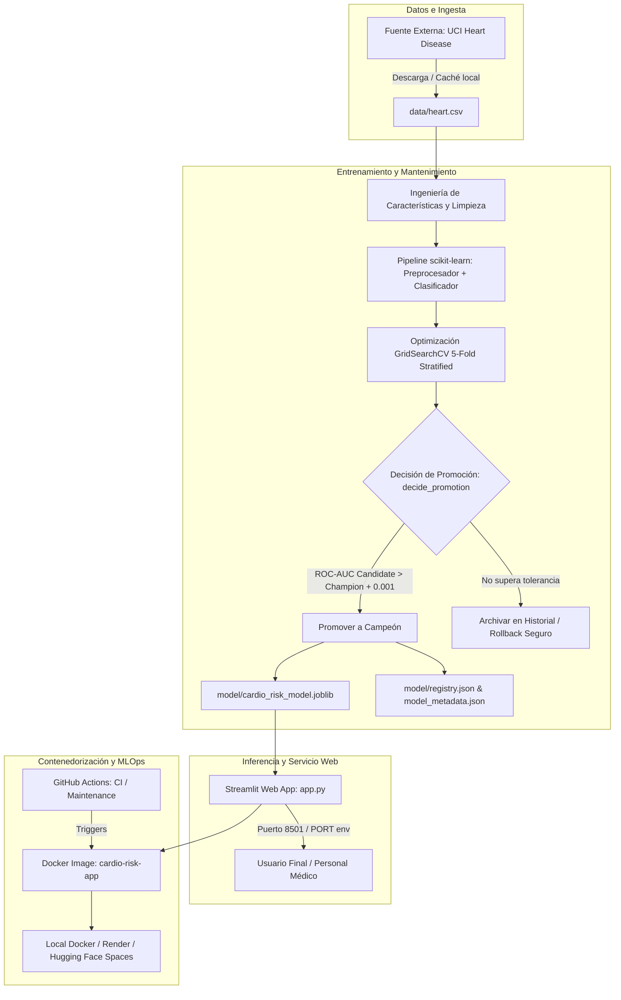
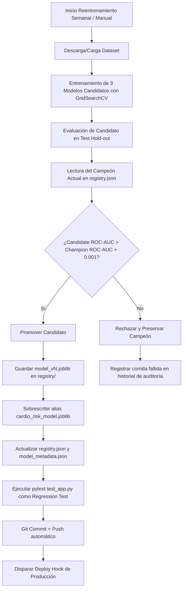

# Documento Técnico Integral y Manual Operativo (Master Documentation)
## Cardiovascular Risk Predictor — Sistema Predictivo y Pipeline MLOps

---

### Ficha Técnica del Proyecto

| Parámetro | Detalle |
|---|---|
| **Proyecto** | Cardiovascular Risk Predictor (Predictor de Riesgo Cardiovascular) |
| **Ámbito** | Aprendizaje de Máquina I — Maestría en Ciencia de Datos, UNA Puno |
| **Objetivo** | Desarrollo, contenedorización, despliegue y automatización del ciclo de vida (CI/CD + Mantenimiento continuo) de un modelo predictivo clínico |
| **Idioma de la Interfaz (UI)** | Inglés (Clinical Form, Validation, Output labels, Risk Indicators) |
| **Stack Principal** | Python 3.11, scikit-learn, Streamlit, Pandas, NumPy, Joblib, Pytest, Docker, GitHub Actions |
| **Paradigma MLOps** | Arquitectura *Champion-Challenger*, desacoplamiento modelo/código, versionado de modelos mediante registro JSON |
| **Estado de Pruebas** | 21 pruebas automatizadas (11 funcionales de app + 10 de CI/mantenimiento), 100% aprobadas |
| **Endpoint de Salud** | `/_stcore/health` (HTTP 200 OK) |

---

## 1. Resumen Ejecutivo y Objetivos

El **Cardiovascular Risk Predictor** es una solución integral orientada a la detección temprana y cribado (*screening*) del riesgo de cardiopatía a partir de variables fisiológicas y clínicas estándar. 

El proyecto resuelve tres desafíos fundamentales de la ingeniería de software y machine learning modernos:
1. **Inferencia Robusta y Accesible:** Provisión de una interfaz web reactiva (`app.py` en Streamlit) que asiste al personal de salud mediante el ingreso de 13 parámetros clínicos estándar, calculando indicadores de riesgo cardiovascular y categorizando el nivel de alerta.
2. **Ciclo de Integración Continua (CI):** Validación automática mediante GitHub Actions de cada cambio en el código fuente, suite de pruebas unitarias/funcionales y construcción íntegra de la imagen de contenedor Docker sin intervención manual.
3. **Pipeline de Mantenimiento Continuo (CD/Retraining):** Reentrenamiento periódico calendarizado mediante arquitectura *Champion-Challenger*, con salvaguarda estricta de métricas (ROC-AUC), tolerancia numérica contra ruido, versionado inmutable de artefactos y capacidad de reversión (*rollback*) automática.

---

## 2. Arquitectura Global del Sistema

El sistema implementa una arquitectura modular desacoplada:



---

## 3. Estructura Exhaustiva del Repositorio

A continuación se detalla la organización de los directorios y el propósito técnico de cada archivo:

```text
card-risk/
│
├── .github/
│   └── workflows/
│       ├── ci.yml                           # Workflow de Integración Continua (Push / PR a main)
│       └── maintenance.yml                  # Workflow de Mantenimiento programado (Cron semanal)
│
├── data/
│   └── heart.csv                            # Dataset de Cleveland (UCI Heart Disease, 303 registros)
│
├── model/
│   ├── cardio_risk_model.joblib             # Alias de PRODUCCIÓN activo consumido por la aplicación
│   ├── model_metadata.json                  # Metadatos, métricas e hiperparámetros del modelo actual
│   ├── registry.json                        # Registro histórico de versiones y campeón vigente
│   └── registry/                            # Artefactos inmutables versionados (model_v1.joblib, etc.)
│
├── app.py                                   # Aplicación web Streamlit (interfaz en inglés)
├── train.py                                 # Script de entrenamiento inicial y ajuste de hiperparámetros
├── retrain_pipeline.py                      # Pipeline de mantenimiento continuo (Champion vs Challenger)
├── test_app.py                              # 11 pruebas funcionales (validación de inputs, inferencia, UI)
├── test_maintenance_ci.py                   # 10 pruebas de mantenimiento (3 casos de la rúbrica MLOps)
│
├── Dockerfile                               # Especificación de contenedor de producción multicapa
├── docker-compose.yml                       # Orquestación declarativa local del servicio
├── .dockerignore                            # Exclusión de archivos innecesarios para builds limpios
├── .gitignore                               # Control de exclusiones en el repositorio Git
├── requirements.txt                         # Dependencias de Python fijadas para reproducibilidad
│
├── README.md                                # Guía introductoria del repositorio
├── INFORME.md                               # Informe técnico de la Unidad I (Entrenamiento y UI)
├── INFORME_TECNICO_MANTENIMIENTO_CI.md      # Informe de la Unidad II (Mantenimiento y CI para TI)
└── INFORMEDETALLE.md                        # Master Documentation (Este documento)
```

### Roles de los Componentes Principales

- **`app.py`:** Interfaz web interactiva en Streamlit. Consume única y exclusivamente el alias `model/cardio_risk_model.joblib`. Desacoplada de las versiones internas de entrenamiento.
- **`train.py`:** Orquesta la descarga de datos, limpieza, ingeniería de variables, búsqueda en grilla (`GridSearchCV`) y exportación del modelo base.
- **`retrain_pipeline.py`:** Implementa la lógica de MLOps. Descarga datos frescos, entrena modelos retadores (*challengers*), compara la métrica de decisión (ROC-AUC) contra el campeón activo en `registry.json`, y actualiza el alias de producción solo si se verifica una mejora real.
- **`Dockerfile`:** Construye una imagen ligera sobre `python:3.11-slim`, instala dependencias, ejecuta `train.py` durante el build (garantizando que la imagen sea completamente autocontenida) y enlaza Streamlit a la variable dinámica `$PORT`.
- **`docker-compose.yml`:** Proporciona arranque, parada y monitoreo de salud (*healthcheck*) de un solo comando.

---

## 4. Datos, Ingeniería de Características y Modelado

### 4.1. Dataset Original
- **Origen:** UCI Heart Disease Dataset (Cleveland Clinic Foundation).
- **Muestras:** 303 pacientes, 14 columnas originales.
- **Variable objetivo (`target`):**
  - `0`: Ausencia de enfermedad cardiovascular significante (< 50% de estrechamiento del diámetro vascular).
  - `1`: Presencia de enfermedad cardiovascular diagnóstica (> 50% de estrechamiento).
- **Tratamiento de Calidad:** Deduplicación (`drop_duplicates()`) y filtrado estricto de nulos (`dropna()`).

### 4.2. Ingeniería de Características Clínicamente Motivadas
Sobre los 13 predictores originales se diseñaron 4 variables derivadas adicionales:

| Característica Derivada | Fórmula Matemática | Fundamentación Clínica |
|---|---|---|
| `bp_chol_ratio` | $\frac{\text{trestbps}}{\text{chol}}$ | Razón entre la presión arterial sistólica en reposo y el colesterol sérico. Evalúa la sobrecarga hemodinámica respecto al nivel lipídico. |
| `age_group` | Bins: `<40`, `40–49`, `50–59`, `60+` | Discretización por grupos de riesgo epidemiológico etario. |
| `max_hr_expected` | $220 - \text{age}$ | Frecuencia cardíaca máxima teórica calculada por la fórmula de Fox y Haskell. |
| `hr_reserve_deficit` | $\text{max\_hr\_expected} - \text{thalach}$ | Déficit cronotrópico; evalúa la incapacidad del miocardio para alcanzar su respuesta de frecuencia esperada bajo esfuerzo. |

### 4.3. Pipeline de Preprocesamiento
Todo el preprocesamiento está encapsulado en un `ColumnTransformer` dentro del `Pipeline` de scikit-learn:
- **Variables Numéricas (8 variables):** `StandardScaler` (centrado en 0 y escalado a varianza unitaria).
- **Variables Categóricas (9 variables):** `OneHotEncoder(handle_unknown="ignore")`.
- **Garantía de Consistencia:** La función `build_feature_row` en `train.py`, `retrain_pipeline.py` y `app.py` asegura que cualquier entrada individual sea transformada idénticamente al conjunto de entrenamiento.

### 4.4. Búsqueda y Optimización de Hiperparámetros
Se exploraron 3 familias de clasificadores mediante `GridSearchCV` con validación cruzada estratificada de 5 folds (`StratifiedKFold(n_splits=5, shuffle=True, random_state=42)`), utilizando **ROC-AUC** como métrica de optimización:

| Algoritmo Candidato | Grilla de Hiperparámetros Explorada | Mejor ROC-AUC (CV) | Configuración Seleccionada |
|---|---|---|---|
| **Regresión Logística** | `C ∈ {0.01, 0.1, 1, 10}`, `solver='lbfgs'` | **0.9077** | `C=0.1`, `solver='lbfgs'` |
| **Random Forest** | `n_estimators ∈ {100, 200, 300}`, `max_depth ∈ {3, 5, 8, None}`, `min_samples_leaf ∈ {1, 2, 4}` | **0.9062** | `n_estimators=100, max_depth=3, min_samples_leaf=4` |
| **Gradient Boosting** | `n_estimators ∈ {100, 200}`, `learning_rate ∈ {0.01, 0.05, 0.1}`, `max_depth ∈ {2, 3, 4}` | **0.8905** | `n_estimators=200, learning_rate=0.01, max_depth=2` |

**Criterio de Selección:** La **Regresión Logística regularizada ($C=0.1$)** obtuvo el mayor ROC-AUC en validación cruzada y fue seleccionada por el principio de parsimonia (máxima interpretabilidad clínica, menor propensión al sobreajuste frente a muestras reducidas y menor costo computacional en inferencia).

### 4.5. Evaluación en Conjunto de Prueba Independiente (Hold-out 20%, 61 pacientes)

| Métrica | Valor | Interpretación y Relevancia Clínica |
|---|---|---|
| **ROC-AUC** | **0.8972** | Excelente capacidad de discriminación probabilística global. |
| **Recall (Sensibilidad)** | **0.9091** | Identifica al **90.91%** de los pacientes con cardiopatía real, minimizando los falsos negativos en cribado. |
| **Precision** | **0.8333** | El 83.33% de los clasificados como alto riesgo efectivamente presentan la condición. |
| **F1-Score** | **0.8696** | Balance armónico óptimo entre sensibilidad y precisión. |
| **Accuracy** | **0.8525** | Tasa de acierto global en 85 de cada 100 pacientes evaluados. |

---

## 5. Arquitectura de Mantenimiento y Champion-Challenger

El pipeline de mantenimiento (`retrain_pipeline.py`) implementa el patrón **Champion-Challenger**:



### Reglas de Promoción Matemática (`decide_promotion`)
1. **Primer Modelo:** Si `champion is None`, cualquier modelo válido se promueve como `v1`.
2. **Tolerancia Numérica:** Para evitar sustituciones por fluctuaciones de redondeo o variaciones estocásticas mínimas, el candidato debe superar al campeón por al menos `PROMOTION_TOLERANCE = 0.001`:
   $$\text{ROC-AUC}_{\text{candidato}} > \text{ROC-AUC}_{\text{campeón}} + 0.001$$
3. **Rollback Seguro:** Si el retador obtiene un desempeño inferior o igual, el alias de producción `model/cardio_risk_model.joblib` permanece intacto, evitando degradaciones del servicio ante datasets anómalos.

---

## 6. Integración Continua y Flujos CI/CD (GitHub Actions)

### 6.1. Flujo de CI (`.github/workflows/ci.yml`)
- **Triggers:** Todo `push` o `pull_request` contra la rama `main`, y ejecución manual (`workflow_dispatch`).
- **Job 1 (`test`):**
  1. Configura Python 3.11 con caché de `pip`.
  2. Instala dependencias (`requirements.txt`).
  3. Ejecuta `train.py` para generar el artefacto de prueba.
  4. Corre `pytest test_app.py -v` (11 pruebas funcionales).
  5. Corre `pytest test_maintenance_ci.py -v` (10 pruebas de MLOps y workflows).
- **Job 2 (`docker-build`):**
  1. Ejecuta `docker/setup-buildx-action`.
  2. Construye la imagen (`docker/build-push-action`, `push: false`) para garantizar que el `Dockerfile` continúe compilando sin errores.

### 6.2. Flujo de Mantenimiento (`.github/workflows/maintenance.yml`)
- **Triggers:** Calendario `cron: "0 3 * * 1"` (todos los lunes a las 03:00 UTC) y manual (`workflow_dispatch`) con parámetro `dry_run`.
- **Acciones:**
  1. Corre `retrain_pipeline.py`.
  2. Si hay nuevo modelo promovido, valida la inferencia con `pytest test_app.py`.
  3. Realiza commit y push automático de `model/` con etiqueta `[skip ci]` (para evitar bucles recursivos con el workflow de CI).
  4. Si existe el secreto `RENDER_DEPLOY_HOOK_URL`, envía una solicitud HTTP POST para actualizar el contenedor en la nube.

---

## 7. Batería de Pruebas Automatizadas (21 Tests)

El proyecto incluye 21 pruebas automatizadas con `pytest`:

```text
============================== 21 passed in 4.66s ==============================
```

### 7.1. Pruebas Funcionales y de Aplicación (`test_app.py` — 11 Tests)
- **`TestInputValidation`:**
  - `test_build_feature_row_returns_expected_schema`: Valida la presencia de las 17 características numéricas y categóricas resultantes.
  - `test_out_of_range_clinical_values_are_flagged`: Pruebas parametrizadas para edad negativa (`-5`), presión arterial nula (`0`) y colesterol negativo (`-10`).
  - `test_categorical_fields_within_allowed_codes`: Comprueba que variables clínicas como `cp`, `restecg`, `slope`, `ca`, `thal` cumplan con los rangos permitidos.
- **`TestModelPrediction`:**
  - `test_model_file_exists`: Asegura la existencia física del modelo serializado.
  - `test_prediction_returns_valid_probability`: Verifica que la salida sea un float continuo en $[0.0, 1.0]$.
  - `test_prediction_label_is_binary`: Verifica que la etiqueta resultante sea estrictamente `0` o `1`.
  - `test_prediction_is_deterministic_for_same_input`: Garantiza reproducibilidad exacta ante entradas idénticas.
- **`TestStreamlitApp` (Tests e2e con `streamlit.testing.v1.AppTest`):**
  - `test_app_loads_without_exceptions`: Simula el renderizado inicial de la interfaz sin excepciones.
  - `test_app_predict_button_returns_result`: Simula la interacción de un usuario completando el formulario y pulsando el botón de cálculo de riesgo.

### 7.2. Pruebas de Mantenimiento y CI (`test_maintenance_ci.py` — 10 Tests)
- **Caso 1 — Promoción cuando el candidato mejora:**
  - `test_candidate_with_better_roc_auc_is_promoted`: Confirma que una mejora superior a la tolerancia promueve al candidato.
  - `test_no_champion_yet_always_promotes_first_model`: Confirma que ante un arranque en frío se promueve el modelo inicial.
- **Caso 2 — No promoción cuando el candidato no mejora (Rollback Seguro):**
  - `test_candidate_with_worse_roc_auc_is_not_promoted`: Bloquea candidatos con menor ROC-AUC.
  - `test_candidate_with_equal_roc_auc_is_not_promoted`: Bloquea candidatos idénticos.
  - `test_candidate_within_tolerance_is_not_promoted`: Bloquea candidatos con mejoras marginales ($< 0.001$).
- **Caso 3 — Validez de los Workflows de CI/CD:**
  - `test_ci_workflow_exists_and_is_valid_yaml`: Valida sintaxis YAML de `ci.yml`.
  - `test_ci_workflow_triggers_on_push_and_pull_request`: Valida disparadores de CI.
  - `test_ci_workflow_runs_the_test_suite`: Comprueba la ejecución de la suite de pruebas.
  - `test_maintenance_workflow_exists_and_is_scheduled`: Valida la expresión cron de mantenimiento.
  - `test_maintenance_workflow_runs_retrain_pipeline`: Valida la invocación del pipeline de reentrenamiento.

---

## 8. Guía de Inicio Rápido (Quickstart)

### Opción A: Ejecución Local en Entorno Virtual Python

```powershell
# 1. Clonar el repositorio y posicionarse en la carpeta
cd c:\Users\lenin\Documents\projects\card-risk

# 2. Crear y activar entorno virtual
python -m venv venv
.\venv\Scripts\Activate.ps1

# 3. Instalar dependencias fijadas
pip install -r requirements.txt

# 4. Entrenar el modelo inicial (genera los artefactos en model/)
python train.py

# 5. Ejecutar la aplicación web
streamlit run app.py
# Acceder en: http://localhost:8501

# 6. Ejecutar la suite completa de pruebas
pytest test_app.py test_maintenance_ci.py -v
```

### Opción B: Ejecución Rápida con Docker Compose (Recomendado)

```powershell
# Levantar el contenedor en segundo plano (build automático)
docker compose up -d

# Verificar el estado y healthcheck
docker compose ps

# Ver logs en tiempo real
docker compose logs -f

# Ejecutar las 21 pruebas dentro del contenedor
docker exec cardio-risk-app pytest test_app.py test_maintenance_ci.py -v

# Detener y desmontar el contenedor
docker compose down
```

---

## 9. Guía Completa de Despliegue con Docker y en la Nube

### 9.1. Despliegue Local con Docker CLI

```powershell
# 1. Construir la imagen de producción
docker build -t cardio-risk-app .

# 2. Ejecutar el contenedor mapeando el puerto 8501
docker run -d --name cardio-risk-app -p 8501:8501 cardio-risk-app

# 3. Validar el endpoint interno de salud
curl.exe http://localhost:8501/_stcore/health
# Debe retornar: HTTP 200 OK -> ok

# 4. Monitorear recursos
docker stats cardio-risk-app

# 5. Detener y remover el contenedor
docker stop cardio-risk-app
docker rm cardio-risk-app
```

### 9.2. Despliegue en Render (Web Service Docker)
1. Subir el código a GitHub (`git push origin main`).
2. Ingresar a [Render Dashboard](https://dashboard.render.com/) y crear un **New Web Service**.
3. Seleccionar el repositorio `card-risk`.
4. En **Environment**, seleccionar **Docker**.
5. Render detectará automáticamente el `Dockerfile`. Render inyecta la variable de entorno `$PORT`; el comando de inicio en el `Dockerfile`:
   ```dockerfile
   CMD ["sh", "-c", "streamlit run app.py --server.port=${PORT} --server.address=0.0.0.0 --server.headless=true"]
   ```
   resuelve dinámicamente el puerto asignado.
6. Copiar el **Deploy Hook URL** desde los ajustes de Render y agregarlo como secreto en GitHub:
   - Nombre: `RENDER_DEPLOY_HOOK_URL`
   - El workflow semanal de mantenimiento desplegará automáticamente cualquier nuevo modelo promovido.

### 9.3. Despliegue en Hugging Face Spaces
1. Crear un nuevo Space en [huggingface.co/new-space](https://huggingface.co/new-space).
2. Seleccionar la opción **Docker** en el SDK de creación.
3. Configurar el control remoto de git y realizar el push del repositorio.
4. En los ajustes del Space (*Settings > Variables*), asignar la variable `PORT=7860` para coincidir con la convención estándar de Hugging Face.

### 9.4. Publicación en Registro de Contenedores (Docker Hub / AWS ECR / GCP Artifact Registry)
```powershell
# Autenticarse
docker login

# Etiquetar la imagen
docker tag cardio-risk-app:latest <tu-usuario-dockerhub>/cardio-risk-app:v1.0.0

# Publicar la imagen
docker push <tu-usuario-dockerhub>/cardio-risk-app:v1.0.0
```

---

## 10. Runbook Operativo para Soporte y TI

| Incidencia / Tarea | Procedimiento de Resolución |
|---|---|
| **Alerta de degradación de inferencia** | 1. Consultar `model/registry.json` para verificar la versión del campeón activo y sus métricas.<br>2. Comprobar el historial reciente de ejecuciones.<br>3. **Rollback manual inmediato:** Copiar el artefacto previo desde `model/registry/model_v{anterior}.joblib` hacia `model/cardio_risk_model.joblib`.<br>4. Ajustar el puntero `champion` en `registry.json` y realizar commit a `main`. |
| **Fallo en el reentrenamiento semanal** | 1. Revisar los logs del job `retrain` en GitHub Actions.<br>2. Verificar conectividad con el mirror de datos en GitHub.<br>3. Ejecutar diagnóstico manual seguro en terminal con: `python retrain_pipeline.py --dry-run`. |
| **Incorporación de un nuevo algoritmo (ej. XGBoost)** | 1. Agregar la definición del estimador y su espacio de búsqueda en la función `get_candidate_models()` de `train.py`.<br>2. La función es consumida automáticamente por `train.py` y `retrain_pipeline.py`, por lo que el pipeline de mantenimiento evaluará al nuevo algoritmo sin requerir cambios adicionales en la lógica de decisión. |
| **Auditoría de versiones** | Cada modelo promovido genera tres pistas de auditoría cruzadas:<br>- Un commit en el repositorio Git (`chore(maintenance): retrain and promote...`).<br>- Un registro estructurado en `model/registry.json`.<br>- Un artefacto descargable en el workflow run de GitHub Actions. |

---

## 11. Consideraciones Éticas y Descargo de Responsabilidad

> [!WARNING]
> **Aviso Médico Importante:** Esta aplicación y los modelos generados constituyen una **prueba de concepto técnica y académica** para el curso de Aprendizaje de Máquina I. **No constituyen una herramienta de diagnóstico clínico directo ni sustituyen el juicio de un profesional de la salud matriculado.** 
> Para un despliegue en un entorno asistencial real se requeriría:
> 1. Validación cruzada externa con cohortes clínicas multiséntricas de mayor escala ($N > 50,000$).
> 2. Calibración empírica de probabilidades mediante métodos como `CalibratedClassifierCV` (isotonic regression / Platt scaling).
> 3. Análisis de explicabilidad local por paciente (ej. SHAP values / LIME) para justificar los factores de riesgo determinantes ante el facultativo.
